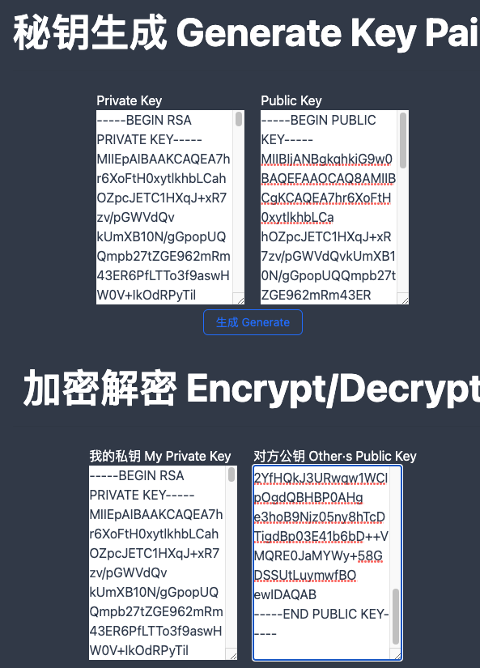

# Message Encryptor

### Main Features
Encrypt message content locally using RSA encryption algorithm. (No server, javascript algorithm runs in your local browser).

Preview URL: https://rsa-encipher.vercel.app/

### Usage
- First, try to generate a key pair (Generate Key Pair), click the "Generate" button to automatically generate a private key and a public key.

- The automatically generated private key will be added to "My Private Key" in the "Encrypt/Decrypt Ops" section; you and the other one need to exchange public keys and add the other party's public key to "Other's Public Key".
**Note: Never reveal your private key**
 

- You can perform message encryption and decryption operations in the "Encrypt/Decrypt Ops" section below.

    - Enter the text you want to send to the other party in the left window, click "Encrypt" to generate encrypted garbled code, and then send it to the other party.
    -The right window is used to copy the encrypted content sent by the other party, click "Decrypt" to see the confidential content.
     
# 消息加密器

### 主要功能

使用RSA加密算法本地加密消息内容。（无服务器，js算法运行在你的本地浏览器）。

预览网址：[https://rsa-encipher.vercel.app/](https://rsa-encipher.vercel.app/)

### 使用方法

- 首先尝试生成秘钥（****Generate Key Pair****），点击 “生成 Generate按钮”，会自动生成私钥(Private Key)和公钥(Public Key)
- 自动生成的私钥会自动添加到下方的 加密/解密 的 “**我的私钥 My Private Key”** 中; 你和对方要交换公钥（Public Key），并在“对方公钥 Other·s Public Key” 处添加对方公钥。
**注意：永远不要暴露你的私钥**
    
    
- 在下方的“**加解密操作 Encrypt/Decrypt Ops**”中即可进行消息加解密操作。
    - 左侧窗口输入你要发给对方的文字，点击“加密 Encrypt”后生成加密后的乱码，然后发给对方即可。
    - 右侧窗口用来将对方发给你的加密后内容拷贝进去，点击“解密 Decrypt” 即可看到机密内容。
    